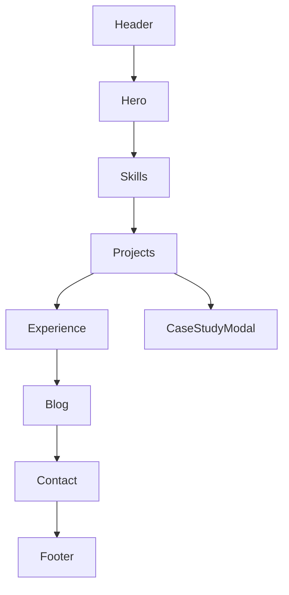

## Developer Handoff — Victor Adoghe Portfolio

This document covers tokens, components, structures, animations, and implementation notes.

### Visual Language
- Accent color: #7A5CFF (neon purple)
- Dark theme: bg #0B1220, surface #0F172A, text #E6E9F2, muted #95A0B4
- Light theme: bg #F8FAFC, surface rgba(255,255,255,.6), text #0B1220, muted #4B5563
- Typography: Inter (400/500/600/700/800), Fira Code (400/500/600)
- Sizes: fs-900 clamp(2.2rem→4rem), fs-800 clamp(1.6rem→2.6rem), fs-700 1.5rem, fs-600 1.25rem, fs-500 1.0625rem, fs-400 1rem
- Line heights: tight 1.15, normal 1.6
- Spacing scale (rem): 0.25, 0.5, 0.75, 1, 1.5, 2, 3, 4, 6
- Container width: 1200px

### Tailwind-ready token mapping
Map CSS variables in `styles.css` to Tailwind config if migrating.

```
// tailwind.config.js (suggested)
theme: {
  extend: {
    colors: {
      accent: '#7A5CFF',
      bg: '#0B1220',
      text: '#E6E9F2',
      muted: '#95A0B4',
    },
    boxShadow: {
      glass: '0 10px 30px rgba(0,0,0,.35), 0 1px 0 rgba(255,255,255,.02) inset',
    },
    borderRadius: {
      glass: '14px',
    },
    fontFamily: {
      sans: ['Inter', 'system-ui', 'sans-serif'],
      mono: ['Fira Code', 'ui-monospace', 'monospace'],
    },
    screens: { sm: '640px', md: '900px', lg: '1200px' },
    spacing: {
      1: '0.25rem', 2: '0.5rem', 3: '0.75rem', 4: '1rem', 6: '1.5rem', 8: '2rem', 12: '3rem', 16: '4rem', 24: '6rem',
    },
  }
}
```

### Component Breakdown
- Header: brand, primary nav, toggles (theme, reduced motion), resume link
- Hero: animated particles and gradient, big heading, role rotator, CTA with cursor glow
- SkillRing: circular progress, tooltip/title, accessible <progress> fallback
- SkillCloud: weighted tags, rearranged on toggle
- ProjectCard: image, summary, tech; overlay actions to case study / GitHub / modal
- CaseStudyModal: modal container to load case study HTML via fetch
- TimelineItem: collapsible item with dot and dates
- BlogCard: chip, title, summary, reading time
- ContactForm: name/email/message, toasts for success/error
- Footer: social icons, copyright

### Sample Structures
- Header
```html
<header class="site-header"><div class="container">…</div></header>
```
- Project card
```html
<article class="project-card" data-tags="frontend">
  
  <div class="card-body">…</div>
  <div class="card-overlay">…</div>
  </article>
```

### Animation Ideas (Framer Motion translation)
- Header: slideDown on mount; background blur transitions on scroll
- Hero title: fadeIn + slight y; stagger children 0.08s
- CTA: whileHover scale 1.02; whileTap scale 0.98
- SkillRing: onInView sweep dashoffset; hover glow
- ProjectCard: fade + scale on filter enter; layoutId for grid reflow
- Modal: backdrop fade; dialog spring in from 12px y
- Timeline: collapse/expand height with spring
- BlogCard: hover lift with shadow intensify

### JS Snippets
- Skill ring progress
```js
const circumference = 2 * Math.PI * 52; // r=52
progress.style.strokeDasharray = String(circumference);
progress.style.strokeDashoffset = String(circumference * (1 - percent/100));
```
- Project filter logic
```js
chips.forEach(chip => chip.addEventListener('click', () => {
  const tag = chip.dataset.filter;
  cards.forEach(card => {
    const tags = (card.dataset.tags||'').split(/\s+/);
    card.hidden = !(tag === 'all' || tags.includes(tag));
  });
}));
```

### Responsive & Grid
- Breakpoints: 640px, 900px, 1200px
- Projects grid: CSS columns 3→2→1
- Blog grid: 3→2→1
- Container max: 1200px; gutters: 1rem

### Accessibility
- Keyboard: modal Esc + backdrop close, focus-visible outlines
- aria: `aria-pressed`, `aria-expanded`, `role=list/listitem` usage
- Reduced motion: toggle + `prefers-reduced-motion` detection
- Color contrast: AA on text and chips

### Performance & SEO
- Use `loading="lazy"` for below-the-fold images
- Inline critical CSS for above-the-fold if needed; defer JS
- Fonts: preconnect GFonts; consider self-hosting for perf
- SEO meta: title, description, canonical, og tags, JSON-LD Person
- Caching: static assets with far-future cache; HTML short TTL
- Deploy: Vercel/Netlify static; enable compression and image optimization

### Live Demo Embeds
- Use GIF previews or CodePen thumbnails within project cards; link out for full demo

### Previews & Component Map
- Exportable SVG previews in `assets/previews/` (desktop and mobile). Export as PNG for deliverables.
- Component map suggestion (Mermaid):


### React Project Skeleton (recommended)
```
src/
  components/
    Header.tsx
    Hero.tsx
    ProjectCard.tsx
    SkillRing.tsx
    Modal.tsx
  pages/
    index.tsx
    case-studies/[slug].tsx
  styles/
    globals.css
    tokens.css
  assets/
```


